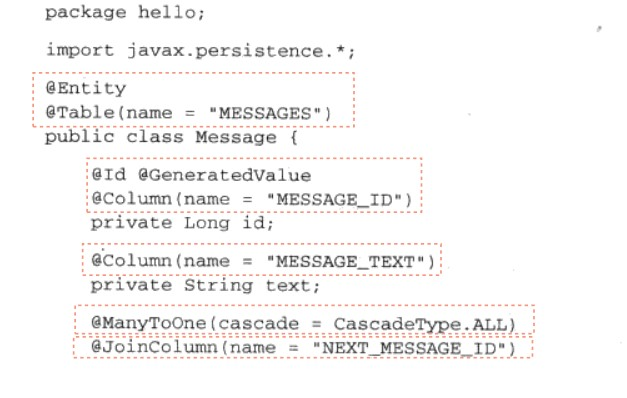

# Hibernate
## 配置
*pdf-page 60*

- 在创建Configuration对象时，会加载classpath根路径下的，使用的`configure()`方法会加载classpath根目录下的`hibernate.properties` java属性文件（此文件并非绝对必要）；
- 在随后调用的`configure()`方法时会使用会自动查找classpath根路径下的配置文件`hibernate.cfg.xml` 文件（此文件绝对必要，且必须拥有全部的所需的配置信息，此文件的配置将会覆盖`hibernate.properties` 文件中的配置）。
	- 若配置文件不在classpath根目录下可以使用`configure()`方法的重载`configure(String path)`，指定配置文件所在的位置。
- 关于配置文件xml，需要在`<property>`标签的`name`属性中声明:
	- `binernate.connection.driver_class`：声明所使用的JDBC驱动
	- `hibernate.connection.url`：声明连接地址, 
	- `hibernate.connection.username`：声明登录数据库用户名, 
	- `hibernate.dialect`

## 使用
1. 创建持久化类（POJO，标准的属性`private`，提供setter，getter方法设置，获得对应的属性，提供无参构造器）。
2. 映射持久化类到对应的数据库Schema中
	1. 可以使用XMl文件声明的方式，命名为`类名.hbm.xml`：
	```
	<? Xmlversion=1. 0"? >
	<! DOCTYPE hibernate-mapping PUBLIC
	"-//H
	bernate/hibernate Mapping DTD//EN"
	"http://hibernate. Sourceforge. Net/hibernate-mapping-3. 0. Dtd">
	<hibernate-mapping>

	    <class
	    name="hello. Message "
	    table="messages">
	        <id
	            name="id"
	            column="message_id">
	            <generator class="increment"/>
	        </id>
	        <property
	            name="text"
	            column="messagetext"/>
	        <many-to-one
	            name= "nextmessage"
	            cascade="all"
	            column="nextmessageid"
	            foreign-key= "FKNEXT_MESSAGE"/>
	        </class>
	
	</hibernate-mapping>
	```
	2. 也可以使用JPA中的注解方式声明：`@Entity`, `@Table`, `@Id`, `@Column`, `@ManyToOne`, `@JoinCloumn`


## 配置连接池

### 使用连接池的原因：
1. 创建新的连接代价很大
2. 维护闲置连接耗费的成本很大
3. 创建预编译（新编译）的查询语句需要耗费的性能

Hibernate内置了c3p0连接池，当然也可以使用其他的连接池
### 配置连接其他连接池
1. 实现`ConnectionProvider`接口，此接口提供了：
	1. `closeConnection(Connection con)`，释放Hibernate使用的连接
	2. `getConnection()`，获得连接供Hibernate使用
	3. `supprotsAggressiveRelease()`
	- Tips：在`getConnection()`中获得一个Connection对象前需要先对连接池配置再创建Connection（若使用Apache DBCP，可以在`BasicDataSource`中使用编程配置；或者使用`BasicDataSourceFactory.createDataSource(Properties pro)`通过外部properties文件获得配置属性）。
2. 在xml配置文件，`name`属性中声明`hibernate.connection.provider_class`并在内容体中声明自己的实现类。
3. 


