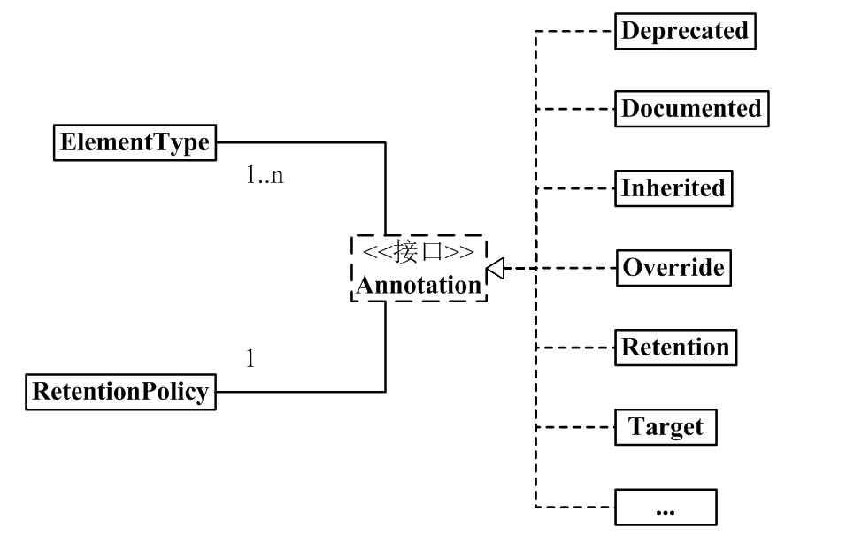

# Annotation 注解
- 声明一个注解类时需要用到`@interface`修饰符，Annotation本质为接口，默认继承了`Annotation`接口。

- 对于`Annotation`接口，有两个辅助类，分别为`ElementType`和`RetentionPlicy`

- 对于一个`Annotation`，有n个`ElemtenType`，但只有一个`RetentionPolicy`



### 详细代码：
- `Annotation`
```
package java.lang.annotation;
public interface Annotation {

    boolean equals(Object obj);

    int hashCode();

    String toString();

    Class<? extends Annotation> annotationType();
}
```
- `ElementType`
```
package java.lang.annotation;

public enum ElementType {
    TYPE,               /* 类、接口（包括注释类型）或枚举声明  */

    FIELD,              /* 字段声明（包括枚举常量）  */

    METHOD,             /* 方法声明  */

    PARAMETER,          /* 参数声明  */

    CONSTRUCTOR,        /* 构造方法声明  */

    LOCAL_VARIABLE,     /* 局部变量声明  */

    ANNOTATION_TYPE,    /* 注释类型声明  */

    PACKAGE             /* 包声明  */
}
```
- `RetentionPolicy`
```
package java.lang.annotation;
public enum RetentionPolicy {
    SOURCE,            /* Annotation信息仅存在于编译器处理期间，编译器处理完之后就没有该Annotation信息了  */

    CLASS,             /* 编译器将Annotation存储于类对应的.class文件中。默认行为  */

    RUNTIME            /* 编译器将Annotation存储于class文件中，并且可由JVM读入 */
}
```
## 声明一个自定义`Annotation`
